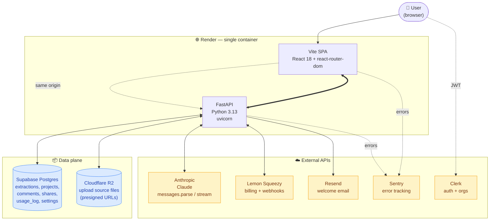

# StoryForge

Turn messy requirement docs (BRDs, meeting notes, emails) into structured user
stories, NFRs, and gap analysis — in one Claude pass.

> Built around the Anthropic Claude API. Single-user, local-first today;
> evolving toward multi-user SaaS. See [PROJECT.md](PROJECT.md) for the live
> build plan.

---

## What it does

Drop a `.pdf`, `.docx`, `.txt`, or `.md` (or paste text) into the upload area.
StoryForge calls Claude with a structured-output schema and returns:

- **Brief** — 1–2 sentence business summary + tags
- **Actors** — distinct roles / systems
- **User stories** — `As a / I want / so that` with 2–5 acceptance criteria each
- **NFRs** — non-functional requirements as a categorised table
- **Gaps & questions** — ambiguities and missing info, severity-ranked

Each gap can be **resolved**, **ignored**, or copied as a markdown
"ask the stakeholder" snippet. Stories can be copied as Jira-friendly markdown.
Past extractions live in the **Documents** page (currently localStorage; SQLite
persistence shipping in M2).

![sketch screenshot would go here once we add screenshots]

---

## Quickstart

### Local dev (recommended for iteration)

```bash
git clone https://github.com/bragadeeshs/brdtoprd.git
cd brdtoprd

# --- Backend ---
cd backend
python3 -m venv .venv
.venv/bin/pip install -r requirements.txt
cp .env.example .env       # edit and paste your ANTHROPIC_API_KEY (optional)
.venv/bin/uvicorn main:app --host 127.0.0.1 --port 8001 --reload

# --- Frontend (in another terminal) ---
cd frontend
npm install
npm run dev
```

Open [http://localhost:5173](http://localhost:5173).

> Without an `ANTHROPIC_API_KEY` the backend runs in **mock mode** — every
> extraction returns the same canned data. Useful for UI work, useless for real
> output. Either set the env var or paste a key in **Settings → API** in the UI
> (BYOK mode, sent per-request via the `X-Anthropic-Key` header).

### Docker (single image)

```bash
docker build -t storyforge .
docker run --rm -p 8000:8000 \
  -e ANTHROPIC_API_KEY=sk-ant-... \
  storyforge
```

Open [http://localhost:8000](http://localhost:8000). The image is multi-stage:
Node builds the Vite frontend, Python serves the API and the static SPA from a
single FastAPI process.

---

## Architecture

Single-container deploy on Render: Vite SPA + FastAPI behind one URL.
Clerk handles auth, Supabase Postgres holds the data, R2 stores upload
sources, Anthropic does the extraction, Lemon Squeezy + Resend do
billing + onboarding email. Sentry catches errors on both ends.



**Key request flows:**

- **Extract** — SPA POSTs `multipart/form-data` to `/api/extract/stream`
  with Clerk JWT. Backend pre-flight (paywall, quota, file size, project
  ownership) → uploads source bytes to R2 → opens Anthropic stream with
  tool-use → streams `usage` SSE frames as tokens arrive → persists to
  Postgres → emits final `complete` frame with the canonical record.
- **Edit / regen / share** — All artifact mutations go through
  `PATCH /api/extractions/{id}` (full-array replacement) or
  `POST /api/extractions/{id}/regen` (Claude redrafts one section using
  user's other sections as stable context). Share links bypass auth via
  opaque tokens at `/api/share/{token}`.
- **Billing** — Lemon Squeezy webhook → `/api/webhooks/lemonsqueezy`
  (HMAC-SHA256 verified) → updates `user_settings.plan` + customer/sub
  ids. Plan gates fire pre-flight on every Claude call.

**Stack details:**

- **Frontend** — React 18 + Vite 5 + react-router-dom 7. Inline styles
  + `styles.css` for tokens (no CSS framework). ~25 inline-SVG icons.
  `@dnd-kit` for drag-reorder, `@sentry/react` for errors. Vitest + RTL
  for tests.
- **Backend** — FastAPI on Python 3.13. SQLModel sessions over Supabase
  (`postgresql+psycopg`); SQLite fallback when `DATABASE_URL` unset.
  Anthropic SDK with `messages.parse()` for non-streaming + `messages.stream()`
  with tool-use for streaming. boto3 for R2 (S3-compatible). httpx for
  Lemon Squeezy + Resend (no SDKs — simpler mocks). pytest + pytest-cov
  for tests, sentry-sdk + JSON-formatted logs for observability.
- **Auth** — Clerk JWT verified server-side via PyJWT + JWKS (cached
  1h). `current_user` FastAPI dep returns `(user_id, org_id, org_role)`.
  Org switching re-issues the JWT with the new claim; `services/scope.py`
  rewrites every list query to filter by `(user_id, org_id IS NULL)` or
  `org_id = :oid`.

---

## Tech stack

| Layer | Pick |
|---|---|
| Frontend | React 18, Vite 5, react-router-dom 7 |
| Backend | FastAPI, SQLModel (M2+), pypdf, python-docx |
| AI | Anthropic SDK · `claude-opus-4-7` default · Sonnet 4.6 / Haiku 4.5 selectable |
| Bundling | Vite (frontend) · multi-stage Dockerfile |
| Auth (planned, M3) | Clerk |
| DB (planned) | SQLite (M2) → Neon Postgres (M3) |
| File storage (planned, M3) | Cloudflare R2 |
| Hosting (planned, M3) | Vercel (frontend) + Render (backend) |

---

## Configuration

All backend config is via env vars, loaded from `backend/.env` at startup.

| Variable | Required | Default | Notes |
|---|---|---|---|
| `ANTHROPIC_API_KEY` | for live extraction | — | Without it, mock mode is used |
| `STORYFORGE_MODEL` | no | `claude-opus-4-7` | Per-request override via `X-Storyforge-Model` header (frontend Settings page sets this) |
| `STORYFORGE_DB` | no | `./storyforge.db` | SQLite file path; coming with M2.1 |
| `STATIC_DIR` | no | `./static` | Where the Docker image places the built SPA |

Frontend has no env vars — all user-facing settings (BYOK key, model choice,
theme) live in `localStorage['storyforge:settings']`.

---

## Project structure

```
.
├── README.md                ← this file
├── PROJECT.md               ← roadmap (modules → tasks, status, decisions)
├── Dockerfile               ← single-image build (Node → Python)
├── wireframes.html          ← original sketch design (reference)
│
├── backend/
│   ├── requirements.txt
│   ├── .env.example
│   ├── main.py              ← FastAPI app, routes, error handlers
│   ├── extract.py           ← Claude integration + mock fallback
│   ├── models.py            ← Pydantic API schemas
│   └── db/                  ← SQLModel schema + session (M2.1)
│
└── frontend/
    ├── package.json
    ├── vite.config.js
    ├── index.html
    └── src/
        ├── main.jsx
        ├── App.jsx          ← top-level routing + state
        ├── api.js           ← fetch wrappers
        ├── styles.css       ← design tokens + utility classes
        ├── components/      ← Sidebar, TopBar, EmptyState, SourcePane,
        │                      ArtifactsPane, GapsRail, Toast, primitives,
        │                      icons
        ├── pages/           ← Documents, Settings
        └── lib/             ← store.js (extractions), settings.js (BYOK +
                               model + theme), clipboard.js, AppContext.jsx
```

---

## Development

```bash
# Backend
cd backend
.venv/bin/uvicorn main:app --reload --port 8001
# auto-reloads on Python file changes; .env edits need a manual restart

# Frontend
cd frontend
npm run dev               # http://localhost:5173, proxies /api → :8001
npm run build             # production build to dist/
npm run preview           # serve the production build locally
```

The Vite dev server proxies `/api/*` to the FastAPI backend, so the frontend
treats them as same-origin in dev.

### Common gotchas

- **Backend on port 8000 won't start** — VS Code uses 8000 for its dev tunnel.
  We default to 8001. The Vite proxy and Dockerfile both reflect this.
- **Mock mode badge in the UI** — happens when `ANTHROPIC_API_KEY` is not in
  the backend env AND no key is set in **Settings → API**. Either fixes it.
- **`messages.parse` is missing on older anthropic SDKs** — we require
  `anthropic >= 0.92.0` (in `requirements.txt`).

---

## Roadmap

[PROJECT.md](PROJECT.md) is the source of truth: modules (M0–M7), sub-modules,
~134 tasks with checkboxes, and a "Done log" of what shipped when.

- ✅ **M1 — UI honesty** (27/30; M1.8 mobile responsive deferred). All sidebar
  items either work or are gone. Real Documents page, real Settings page,
  toasts, scroll-spy, gap actions.
- ⏳ **M2 — Persistence** (SQLite + extraction history + projects + versioning).
  In progress.
- ⏳ **M3 — Auth + SaaS** (Clerk + Neon Postgres + Stripe scaffold + R2).
- M4–M7 — Editing/collab · streaming + source citations · integrations · advanced
  templates. Detail when M3 ships.

Decisions still pending (see top of [PROJECT.md](PROJECT.md)): target user,
pricing model, BYOK vs managed key, free-tier limits.

---

## Contributing

This is a private build today. If you have access to the repo and want to push
work back, branch off `main`, keep commits scoped to a single PROJECT.md task
ID, and reference the task in the commit subject (`M2.1: …`). Pull requests
welcome once the project goes public.
